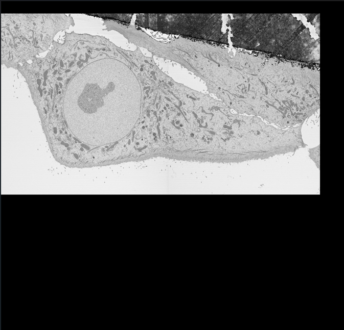
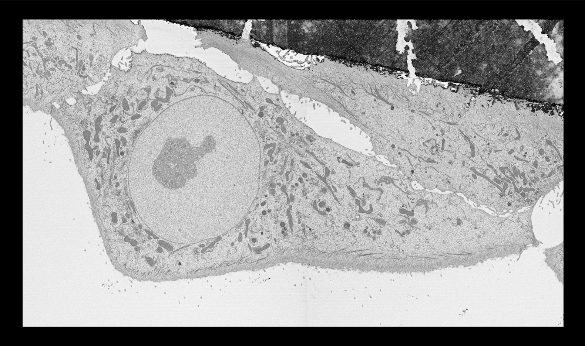
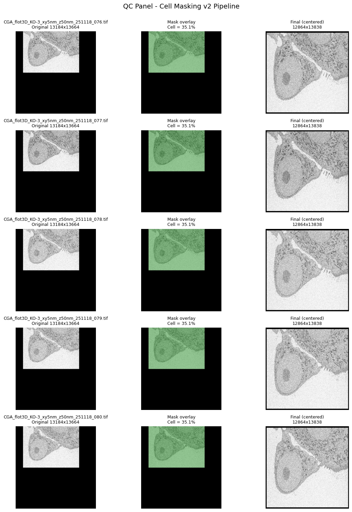
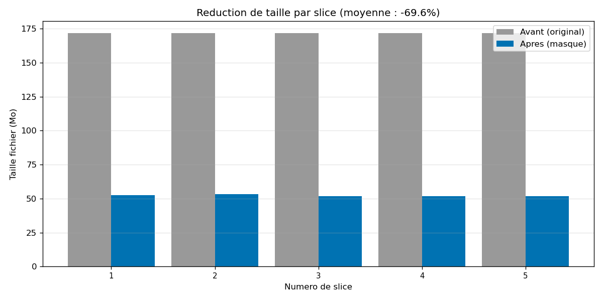
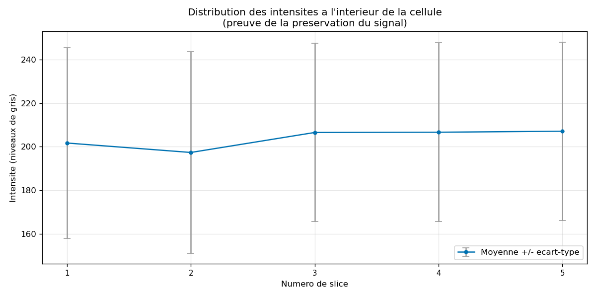
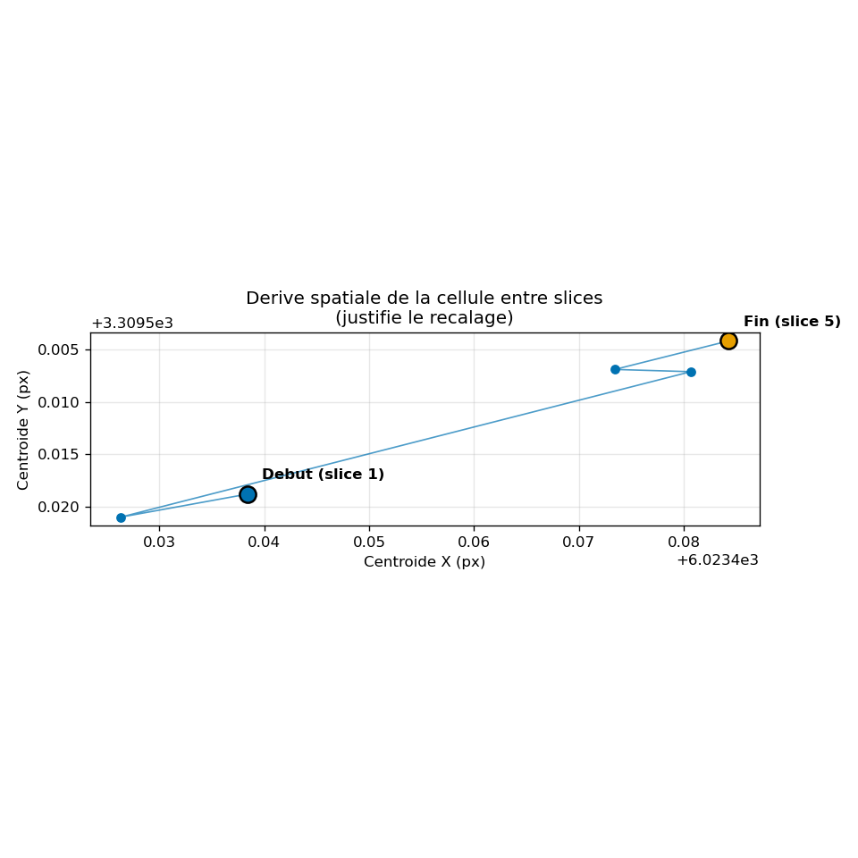
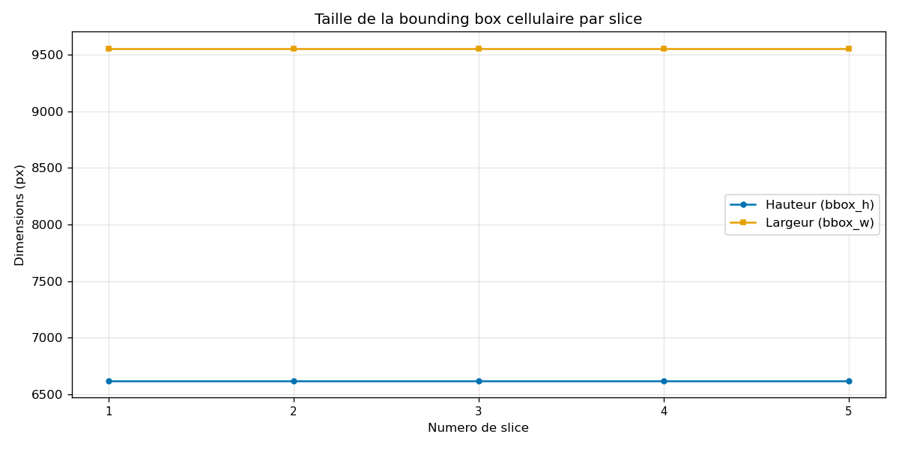
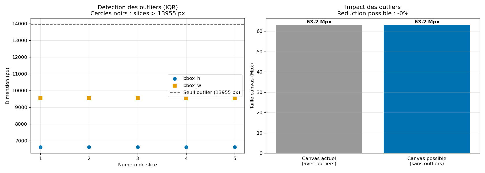

# Example: a real SBF-SEM run

This walkthrough runs CellFocus on a real SBF-SEM acquisition of an MCF10A cell.
Each raw slice is 13184 x 13664 pixels and is dominated by empty resin
background.

## One slice, before and after

In the raw slice, the cell occupies only part of a large field, surrounded by a
lot of uninformative space.


*Before: the cell sits in a large mostly-empty field.*

After CellFocus, the image is cropped and re-centered on the cell, so almost the
whole frame is now informative.


*After: cropped and re-centered on the cell, with the empty border removed.*

## Quality control across the stack

For every run, CellFocus writes a QC panel showing, for several slices, the
original crop, the detected cell mask (green overlay), and the final re-centered
result. It lets you check at a glance that the mask tracks the cell correctly on
each slice.


*Per slice: original, detected mask (green), and final re-centered output.*

## What the metrics show

CellFocus also writes five diagnostic graphs. On a short five-slice test run they
read as follows.

### Size reduction



Masking alone cuts each slice by about 70% (from ~172 MB to ~52 MB) without any
loss of resolution, purely because the removed background compresses to almost
nothing. Adding `--output-scale 2` pushes the total reduction well above 90%.

### Signal preservation



The mean intensity inside the cell stays flat across slices (around 200), which
shows the masking does not alter the biological signal it keeps. This is the
evidence that the reduction is not destroying information.

### Cell drift and re-centering



The cell centroid moves across slices. On a few adjacent slices the drift is
sub-pixel (note the axis offsets), but across a full 125-slice stack it becomes
large. That drift is exactly why the slices are re-centered on a common canvas:
without it, the 3D stack would no longer be aligned.

### Bounding box and outliers





The bounding box is stable here (about 6600 x 9550 px), so no slice is flagged as
an outlier and no further canvas reduction is possible on this subset. On a full
volume, this IQR check flags aberrant slices (a masking failure or a fold) whose
oversized box would otherwise inflate the common canvas for every slice.

## Reproduce this

```bash
cellfocus --input path/to/slices --output out --n-samples 5
```

The `out/` folder then contains the three TIFF series, this QC panel, the five
graphs and the CSV metrics.
